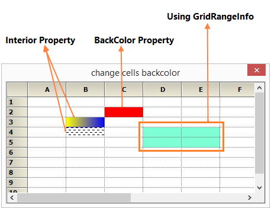

# How-to-change-a-cell-s-background-color-in-WinForms-GridControl
The [GridStyleInfo](https://help.syncfusion.com/cr/windowsforms/Syncfusion.Windows.Forms.Grid.GridStyleInfo.html) object has a BackColor property that you can use to set the background color in the [WinForms GridControl](https://www.syncfusion.com/winforms-ui-controls/grid-control). Additionally, you can utilize the [Interior](https://help.syncfusion.com/cr/windowsforms/Syncfusion.Windows.Forms.Grid.GridStyleInfo.html#Syncfusion_Windows_Forms_Grid_GridStyleInfo_Interior) property and assign it a BrushInfo object to specify the background as a brush. Similarly, you can change the BackColor for a range of cells by using the ChangeCells method.


**C#**
```
// Set the backcolor for a particular cell
this.gridControl1[2, 3].BackColor = Color.Red;

// Set the backcolor using Interior property
this.gridControl1[3, 2].Interior = new BrushInfo(GradientStyle.Horizontal, Color.Yellow, Color.Blue);
this.gridControl1[4, 2].Interior = new BrushInfo(PatternStyle.DashedHorizontal, Color.Black, Color.White);

// Set the backcolor for a range of cells
GridStyleInfo style = new GridStyleInfo();
style.BackColor = Color.Aquamarine;
this.gridControl1.ChangeCells(GridRangeInfo.Cells(4, 4, 5, 5), style);
```

**VB**
```
' Set the backcolor for a particular cell
Me.GridControl1(2, 3).BackColor = Color.Red

' Set the backcolor using Interior property
Me.GridControl1(3, 2).Interior = New BrushInfo(GradientStyle.Horizontal, Color.Yellow, Color.Blue)
Me.GridControl1(4, 2).Interior = New BrushInfo(PatternStyle.DashedHorizontal, Color.Black, Color.White)

' Set the backcolor for a range of cells
Dim style As New GridStyleInfo()
style.BackColor = Color.Aquamarine
Me.GridControl1.ChangeCells(GridRangeInfo.Cells(4, 4, 5, 5), style)
Using QueryCellInfo Event
```


QueryCellInfo Event can also be used to set the BackColor of a cell or range of cells.

**C#**
```
private void OnQueryCellInfo(object sender, GridQueryCellInfoEventArgs e)
{
    // Set the backcolor for a particular cell
    if (e.RowIndex == 2 && e.ColIndex == 3)
        e.Style.BackColor = Color.Red;

    // Set the backcolor using Interior property
    if (e.RowIndex == 3 && e.ColIndex == 2)
        e.Style.Interior = new BrushInfo(GradientStyle.Horizontal, Color.Yellow, Color.Blue);
    if (e.RowIndex == 4 && e.ColIndex == 2)
        e.Style.Interior = new BrushInfo(PatternStyle.DashedHorizontal, Color.Black, Color.White);

    // Set the backcolor for a range of cells
    if ((e.RowIndex == 4 || e.RowIndex == 5) && (e.ColIndex == 4 || e.ColIndex == 5))
        e.Style.BackColor = Color.Aquamarine;
}
```

**VB**
```
Private Sub OnQueryCellInfo(sender As Object, e As GridQueryCellInfoEventArgs)
    ' Set the backcolor for a particular cell
    If e.RowIndex = 2 AndAlso e.ColIndex = 3 Then
        e.Style.BackColor = Color.Red
    End If

    ' Set the backcolor using Interior property
    If e.RowIndex = 3 AndAlso e.ColIndex = 2 Then
        e.Style.Interior = New BrushInfo(GradientStyle.Horizontal, Color.Yellow, Color.Blue)
    End If

    If e.RowIndex = 4 AndAlso e.ColIndex = 2 Then
        e.Style.Interior = New BrushInfo(PatternStyle.DashedHorizontal, Color.Black, Color.White)
    End If

    ' Set the backcolor for a range of cells
    If (e.RowIndex = 4 OrElse e.RowIndex = 5) AndAlso (e.ColIndex = 4 OrElse e.ColIndex = 5) Then
        e.Style.BackColor = Color.Aquamarine
    End If
End Sub
```
 
After applying the properties, the grid cell is shown below,

